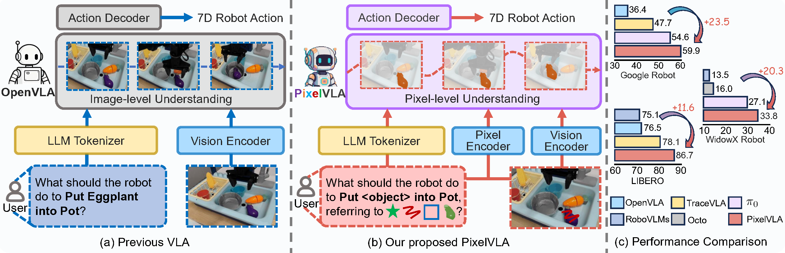
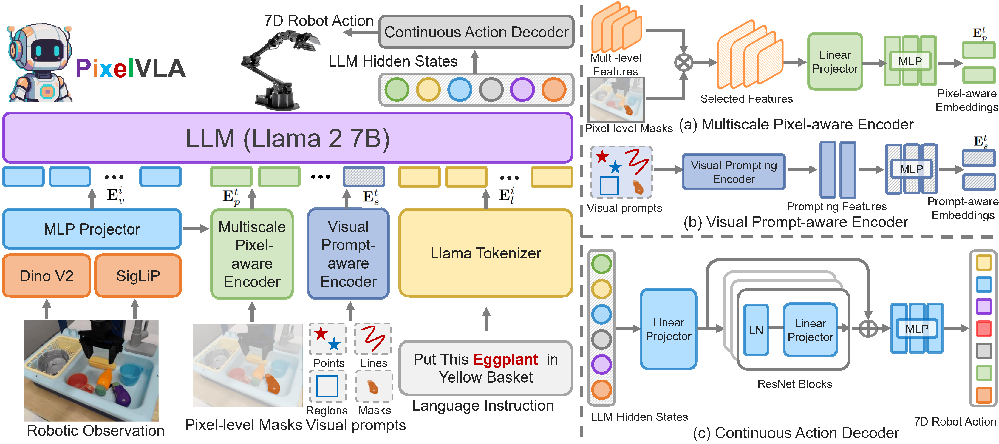
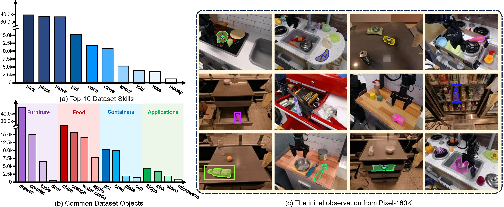
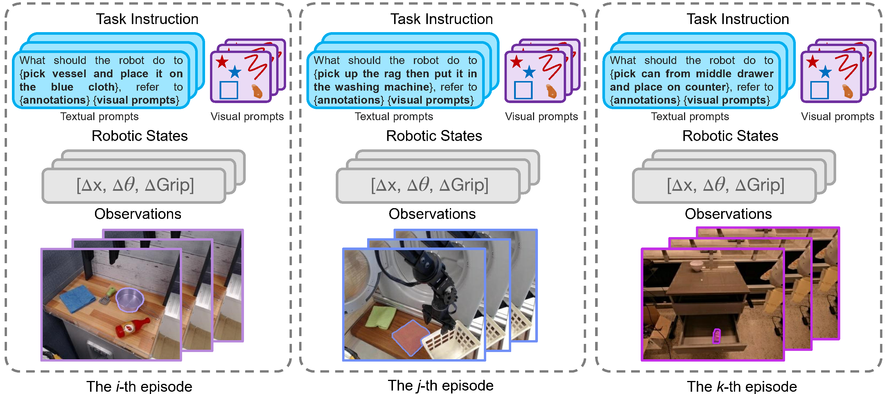
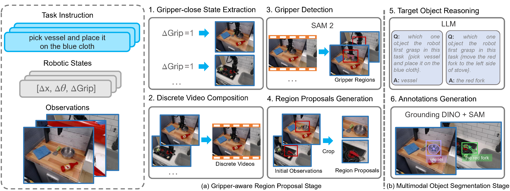
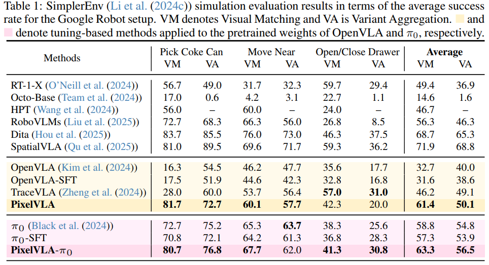
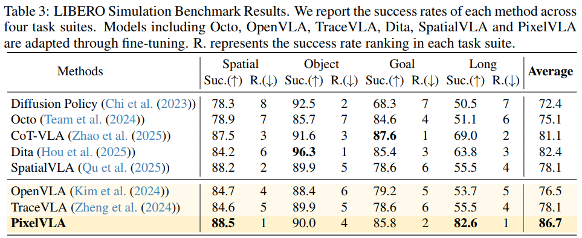
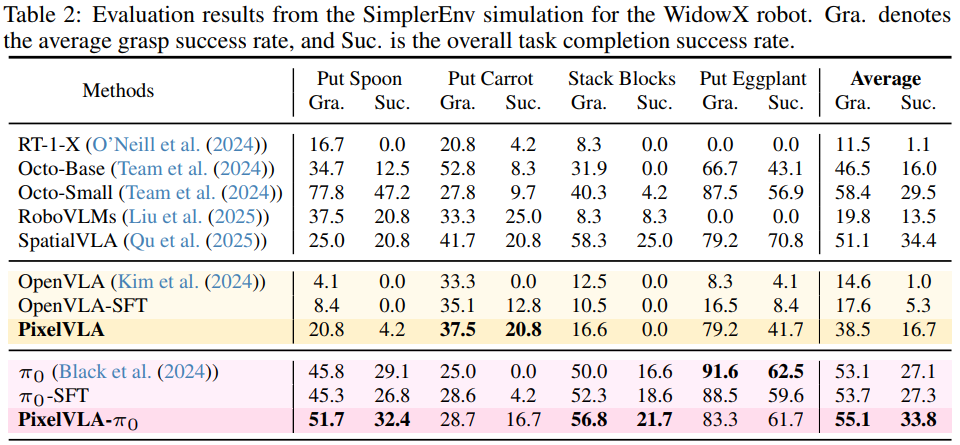

# PixelVLA: Advancing Pixel-level Understanding in Vision-Language-Action Model

[](https://arxiv.org/abs/2511.01571)
[](https://wenqiliang.github.io/PixelVLA/)
[](https://github.com/WenqiLiang/PixelVLA)

Official repository for **PixelVLA**, a vision-language-action model that advances **pixel-level understanding** and **multimodal prompting** for robotic manipulation.

<p align="center">
  
</p>

## Overview

Vision-Language-Action models (VLAs) have recently shown strong generalization and instruction-following ability for robotic control. However, most existing VLAs still operate mainly at the **image level** and rely heavily on **text-only prompts**, which limits fine-grained spatial reasoning and flexible human-robot interaction.

**PixelVLA** addresses these limitations by introducing:

- a **Visual Prompt-aware Encoder** for points, lines, regions, and masks,
- a **Multiscale Pixel-aware Encoder** for injecting pixel-level spatial information,
- a **Continuous Action Decoder** for precise 7D robot action prediction.

In addition, we propose a two-stage automated annotation pipeline to build **Pixel-160K**, a large-scale visuomotor instruction-tuning dataset with pixel-level annotations and visual prompts.

## Highlights

- **First VLA with pixel-level reasoning and multimodal prompting**
- Supports **text + visual prompts** such as points, lines, regions, and masks
- Introduces **Pixel-160K** with pixel-aware robot supervision
- Improves manipulation success by **10.1%–28.7% over OpenVLA**
- Requires only **1.5% of OpenVLA pretraining cost**

## Method

PixelVLA extends a VLA backbone with three key components:

### 1. Visual Prompt-aware Encoder

Encodes user-provided prompts such as:

- points
- lines
- bounding regions
- masks

This allows the model to preserve image-space spatial cues and respond to richer instructions than text alone.

### 2. Multiscale Pixel-aware Encoder

Extracts multi-level visual features and injects pixel-aware information into the token stream, enabling fine-grained grounding for robotic manipulation.

### 3. Continuous Action Decoder

Instead of relying only on discretized action tokens, PixelVLA predicts continuous 7D robot actions from LLM hidden states for more precise control.

<p align="center">
  
</p>

## Pixel-160K Dataset

To support pixel-level visuomotor tuning, we build **Pixel-160K**, a new dataset containing:

- **160K** robot manipulation episodes
- **6.5M** image-text-action triplets
- pixel-level masks
- multimodal visual prompts

The dataset is generated by a two-stage automated annotation pipeline:

1. **Gripper-aware region proposal**
2. **Multimodal object segmentation**

<p align="center">
  
</p>

## Appendix Examples

Below are examples of pixel-aware training samples and the automated annotation pipeline.

<p align="center">
  
  
</p>

## Main Results

PixelVLA shows strong improvements on both zero-shot manipulation and adaptation to new robot setups.

### SimplerEnv (Google Robot)

- **Visual Matching:** 32.7 → **61.4**
- **Variant Aggregation:** 40.0 → **50.1**

### SimplerEnv (WidowX)

- PixelVLA also improves performance on WidowX settings
- PixelVLA-π0 achieves stronger grasp and success rates than the π0 baseline

### LIBERO

- **OpenVLA:** 76.5
- **PixelVLA:** **86.7**
- 
<h3 style="margin:28px 0 14px; font-size:1.2rem;">Selected Tables from the Paper</h3>

<div class="appendix-grid">
  <div class="figure-card">
    
    <div class="figure-caption">
      Table 1. SimplerEnv evaluation on the Google Robot setup.
    </div>
  </div>

  <div class="figure-card">
    
    <div class="figure-caption">
      Table 3. LIBERO benchmark results across four task suites.
    </div>
  </div>
</div>

<div class="appendix-grid" style="margin-top:20px;">
  <div class="figure-card">
    
    <div class="figure-caption">
      Table 2. SimplerEnv evaluation on the WidowX robot setup.
    </div>
  </div>

  <div class="figure-card">
    
    <div class="figure-caption">
      Figure 4. Performance under camera, lighting, background, distractor, and table-texture variations.
    </div>
  </div>
</div>

## Project Page

Visit the project page for more visualizations and figures:

**Project Page:** https://wenqiliang.github.io/PixelVLA/

## Paper

**arXiv:** https://arxiv.org/abs/2511.01571

If you find this project useful, please cite:

```bibtex
@inproceedings{liang2026pixelvla,
  title={PixelVLA: Advancing Pixel-level Understanding in Vision-Language-Action Model},
  author={Liang, Wenqi and Sun, Gan and He, Yao and Dong, Jiahua and Dai, Suyan and Laptev, Ivan and Khan, Salman and Cong, Yang},
  booktitle={International Conference on Learning Representations},
  year={2026}
}
